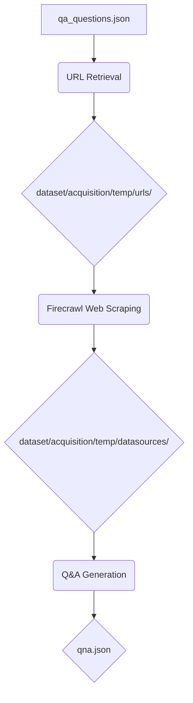

# EMTP - Expert Model Training Pipeline

EMTP is a comprehensive pipeline for acquiring, processing, and preparing data for training expert AI models. The pipeline focuses on quality assurance (QA) related content, systematically collecting questions, retrieving relevant URLs using DuckDuckGo search with optional dorks support, and scraping web content directly into markdown format using a self-hosted Firecrawl API.

## Key Features

- **Interactive Pipeline**: Choose individual stages or run the full pipeline with custom paths
- **DuckDuckGo Search with Dorks**: Uses DuckDuckGo for URL retrieval with optional search operators (privacy-focused, no Google)
- **Firecrawl Integration**: Self-hosted Firecrawl API for direct web content scraping into markdown format
- **Simplified Pipeline**: Direct markdown output eliminates need for OCR processing in the main pipeline
- **Unicode Handling**: Automatically processes and normalizes Unicode characters in questions
- **Temp Directory Management**: Uses organized temp directories for intermediate data storage
- **Modular Architecture**: Clean separation of acquisition, enrichment, and training stages

## Project Structure

```
emtp/
├── main.py                 # Main interactive pipeline orchestrator
├── requirements.txt        # Lists all Python package dependencies for the project
├── qna_dataset.json        # Generated Q&A dataset from processed text data
├── .gitignore              # Specifies intentionally untracked files and directories to ignore by Git
├── dataset/                # Top-level directory for all data, organized into acquisition, enrichment, and questions
│   ├── .about.md           # Provides an overview of the dataset directory's purpose and contents
│   ├── acquisition/        # Contains all modules and scripts responsible for data acquisition stages
│   │   ├── __init__.py     # Marks `acquisition` as a Python package and handles module connections
│   │   ├── .about.md       # Detailed documentation for the data acquisition process
│   │   ├── temp/           # Temporary storage for intermediate data generated during acquisition
│   │   │   ├── urls/       # Stores JSON files containing URLs retrieved from search engines
│   │   │   ├── datasources/ # Stores captured web page screenshots and downloaded PDFs
│   │   │   └── text_data/    # Stores extracted text data from screenshots and PDFs
│   │   ├── retrieve_url/   # Python module dedicated to retrieving URLs based on QA questions
│   │   └── save_datasource/ # Python module dedicated to web scraping using self-hosted Firecrawl API
│   ├── enrichment/         # Contains data enrichment and Q&A generation modules
│   └── questions/          # Stores question datasets and related files
└── training/               # Placeholder for future model training components and scripts
```

## Quick Start

1. **Install dependencies:**
   ```bash
   pip install -r requirements.txt
   ```

2. **Run the interactive pipeline:**
   ```bash
   python main.py
   ```

   This launches an interactive menu where you can:
   - Choose individual stages with custom input/output paths
   - Run the full pipeline (asks only for questions file and final screenshot output)
   - Exit the session

## Non-Interactive Execution

You can also run the pipeline directly using command-line arguments, which is useful for automation or scripting. Use the `--stage` argument to specify which part of the pipeline to run.

```bash
python main.py --stage full_pipeline --questions-file dataset/acquisition/retrieve_url/sample.json --verbose --dorks "filetype:pdf"
```

## Pipeline Stages

### 1. URL Retrieval (`dataset/acquisition/retrieve_url/`)
- Reads questions from `dataset/acquisition/retrieve_url/sample.json` (or specified via `--questions-file`)
- Searches DuckDuckGo for relevant URLs
- Saves categorized results to `dataset/acquisition/temp/urls/`

### 2. Datasource Capture (`dataset/acquisition/save_datasource/`)
- Reads URLs from `dataset/acquisition/temp/urls/`
- Uses self-hosted Firecrawl API to scrape web content directly into markdown format
- Saves markdown files to `dataset/acquisition/temp/datasources/`

### 3. Q&A Generation (`dataset/enrichment/qa_generation.py`)
- Processes markdown files from `dataset/acquisition/temp/datasources/`
- Generates Q&A pairs for model training
- Note: Datasource processing (OCR/PDF text extraction) is skipped in the full pipeline since Firecrawl provides clean markdown output

## Data Flow



## Requirements

- Python 3.8+
- Internet connection for web scraping and searches
- Self-hosted Firecrawl instance running (default: localhost:3002)

## Individual Stage Execution

You can run individual stages through the interactive menu in `main.py`, or directly from their respective directories, or via the non-interactive `main.py` entry point:

```bash
# Non-interactive URL retrieval only
python main.py --stage url_retrieval --questions-file dataset/acquisition/retrieve_url/sample.json --urls-output-dir custom/output --dorks "filetype:pdf site:stackoverflow.com"

# Non-interactive Datasource capture only
python main.py --stage datasource_capture --urls-output-dir custom/input --datasources-output-dir custom/output

# Non-interactive Q&A generation only
python main.py --stage qa_generation --datasources-output-dir custom/input
```

## Configuration

- Modify `dataset/acquisition/retrieve_url/sample.json` or create a new JSON file to change the source questions.
- Configure screenshot settings in `save_screenshot/main.py`

## Dependencies

- `ddgs`: DuckDuckGo search API
- `requests`: HTTP requests for Firecrawl API communication
- `json_parser`: Custom module for extracting URLs from JSON
- `file_finder`: Custom module for finding JSON files

## Notes

- All paths are resolved relative to project root
- Unicode characters in questions are automatically normalized
- Temporary directories are created automatically
- Web content is scraped directly into markdown format using self-hosted Firecrawl
- The full pipeline skips OCR processing since Firecrawl provides clean markdown output
