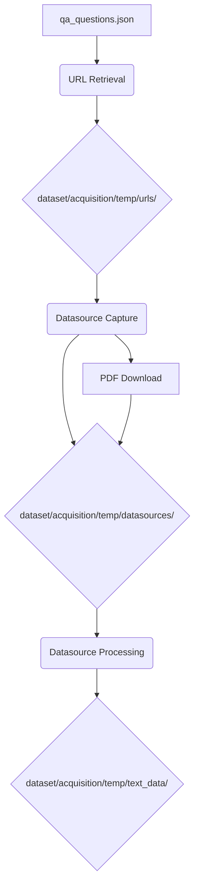

# EMTP - Expert Model Training Pipeline

EMTP is a comprehensive pipeline for acquiring, processing, and preparing data for training expert AI models. The pipeline focuses on quality assurance (QA) related content, systematically collecting questions, retrieving relevant URLs using DuckDuckGo search with optional dorks support, and capturing webpage screenshots or downloading PDFs.

## Key Features

- **Interactive Pipeline**: Choose individual stages or run the full pipeline with custom paths
- **DuckDuckGo Search with Dorks**: Uses DuckDuckGo for URL retrieval with optional search operators (privacy-focused, no Google)
- **PDF Support**: Automatic detection and downloading of PDF files when using `filetype:pdf` dorks
- **Unicode Handling**: Automatically processes and normalizes Unicode characters in questions
- **Temp Directory Management**: Uses organized temp directories for intermediate data storage
- **Modular Architecture**: Clean separation of acquisition, enrichment, and training stages
- **Multi-format Processing**: Handles both webpage screenshots (PNG) and PDF documents

## Project Structure

```
emtp/
├── main.py                 # Main interactive pipeline orchestrator
├── requirements.txt        # Lists all Python package dependencies for the project
├── qna_dataset.json        # Generated Q&A dataset from processed text data
├── .gitignore              # Specifies intentionally untracked files and directories to ignore by Git
├── dataset/                # Top-level directory for all data, organized into acquisition, enrichment, and questions
│   ├── README.md           # Provides an overview of the dataset directory's purpose and contents
│   ├── acquisition/        # Contains all modules and scripts responsible for data acquisition stages
│   │   ├── __init__.py     # Marks `acquisition` as a Python package and handles module connections
│   │   ├── README.md       # Detailed documentation for the data acquisition process
│   │   ├── temp/           # Temporary storage for intermediate data generated during acquisition
│   │   │   ├── urls/       # Stores JSON files containing URLs retrieved from search engines
│   │   │   ├── datasources/ # Stores captured web page screenshots and downloaded PDFs
│   │   │   └── text_data/    # Stores extracted text data from screenshots and PDFs
│   │   ├── retrieve_url/   # Python module dedicated to retrieving URLs based on QA questions
│   │   ├── save_datasource/ # Python module dedicated to capturing screenshots and downloading PDFs from URLs
│   │   └── datasource_processing/ # Python module for OCR and text extraction from data sources
│   ├── enrichment/         # Contains data enrichment and Q&A generation modules
│   └── questions/          # Stores question datasets and related files
└── training/               # Placeholder for future model training components and scripts
```

## Quick Start

1. **Install dependencies:**
   ```bash
   pip install -r requirements.txt
   ```

2. **Run the interactive pipeline:**
   ```bash
   python main.py
   ```

   This launches an interactive menu where you can:
   - Choose individual stages with custom input/output paths
   - Run the full pipeline (asks only for questions file and final screenshot output)
   - Exit the session

## Non-Interactive Execution

You can also run the pipeline directly using command-line arguments, which is useful for automation or scripting. Use the `--stage` argument to specify which part of the pipeline to run.

```bash
python main.py --stage full_pipeline --questions-file dataset/acquisition/retrieve_url/sample.json --text-data-output-dir dataset/acquisition/temp/text_data --accurate --verbose --dorks "filetype:pdf"
```

## Pipeline Stages

### 1. URL Retrieval (`dataset/acquisition/retrieve_url/`)
- Reads questions from `dataset/acquisition/retrieve_url/sample.json` (or specified via `--questions-file`)
- Searches DuckDuckGo for relevant URLs
- Saves categorized results to `dataset/acquisition/temp/urls/`

### 2. Datasource Capture (`dataset/acquisition/save_datasource/`)
- Reads URLs from `dataset/acquisition/temp/urls/`
- Captures full-page screenshots using Selenium for web pages
- Downloads PDF files directly when dorks indicate PDF content
- Saves PNG images and PDF files to `dataset/acquisition/temp/datasources/`

### 3. Datasource Processing (`dataset/acquisition/datasource_processing/`)
- Reads PNG images and PDF files from `dataset/acquisition/temp/datasources/` (recursively through subdirectories)
- Performs OCR to extract text from images and direct text extraction from PDFs
- Cleans and processes the extracted text. Can use `--accurate` flag for more robust cleaning.
- Saves text data to `dataset/acquisition/temp/text_data/`

## Data Flow



## Requirements

- Python 3.8+
- Chrome/Chromium browser (for Selenium WebDriver)
- Internet connection for web scraping and searches

## Individual Stage Execution

You can run individual stages through the interactive menu in `main.py`, or directly from their respective directories, or via the non-interactive `main.py` entry point:

```bash
# Non-interactive URL retrieval only
python main.py --stage url_retrieval --questions-file dataset/acquisition/retrieve_url/sample.json --urls-output-dir custom/output --dorks "filetype:pdf site:stackoverflow.com"

# Non-interactive Datasource capture only
python main.py --stage datasource_capture --urls-output-dir custom/input --datasources-output-dir custom/output

# Non-interactive Datasource processing only (with accurate mode)
python main.py --stage datasource_processing --datasources-output-dir custom/input --text-data-output-dir custom/output --accurate
```

## Configuration

- Modify `dataset/acquisition/retrieve_url/sample.json` or create a new JSON file to change the source questions.
- Configure screenshot settings in `save_screenshot/main.py`

## Dependencies

- `ddgs`: DuckDuckGo search API
- `selenium`: Web browser automation
- `webdriver-manager`: Automatic ChromeDriver management
- `Pillow`: Image processing for screenshots
- `pypdf`: PDF text extraction and processing
- `pytesseract`: OCR (Optical Character Recognition) for images

## Notes

- All paths are resolved relative to project root
- Unicode characters in questions are automatically normalized
- Temporary directories are created automatically
- Screenshots are saved as PNG files with timestamps